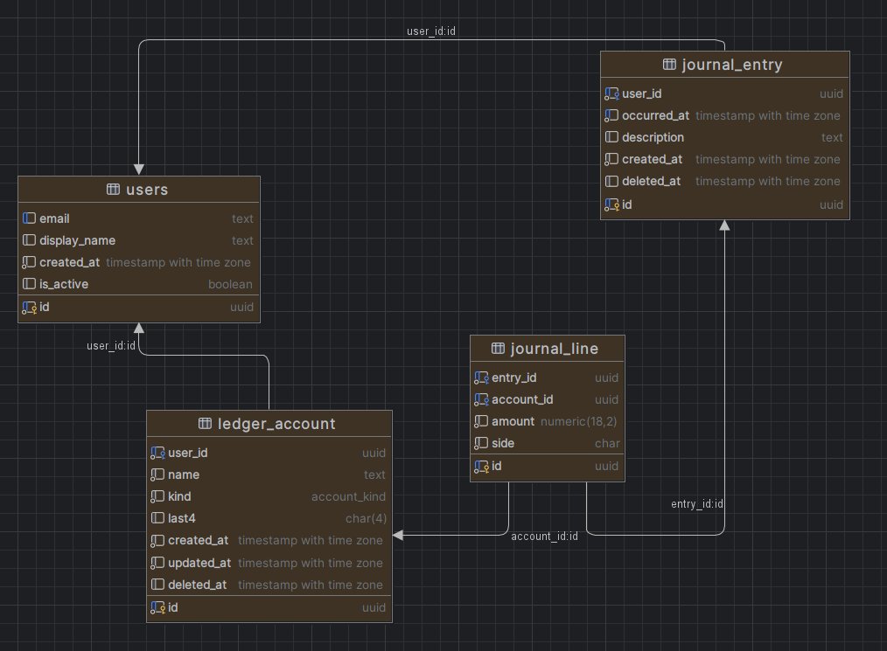

# Nexaris Finances Backend

Sistema de gestión financiera personal desarrollado en Python con FastAPI y PostgreSQL.

## 📱 Descripción del Proyecto

**Nexaris Finances** es una aplicación móvil de finanzas personales que permite registrar de forma sencilla gastos, ingresos, transferencias y deudas. El sistema utiliza un libro mayor en doble entrada "por debajo" para garantizar que los saldos sean precisos, permite múltiples cuentas (banco, efectivo, tarjetas) y funciona offline con sincronización.

### 🏗️ Arquitectura

-   **Frontend**: React Native + Expo (aplicación móvil)
-   **Backend**: FastAPI (API REST)
-   **Base de Datos**: PostgreSQL
-   **Funcionalidad**: Offline con sincronización

## 🎯 ¿Qué Resuelve?

### 1. **Captura Rápida y Consistente de Movimientos**

-   Interfaz intuitiva para registrar transacciones de forma rápida
-   Base sólida para implementar OCR/voz en el futuro
-   Preparado para lectura semiautomática de notificaciones bancarias
-   Validación automática de balance (débitos = créditos)

### 2. **Clasificación Inteligente por Categorías**

-   Categorías personalizables creadas por el usuario
-   Estructura preparada para aprendizaje automático
-   Clasificación automática de transacciones recurrentes
-   Análisis de patrones de gasto

### 3. **Saldos Reales y Precisos**

-   Sistema de doble entrada que garantiza precisión contable
-   Saldos reales por cuenta, incluyendo valores negativos
-   Sin trucos contables ni aproximaciones
-   Trazabilidad completa de cada transacción

### 4. **Trazabilidad Clara del Dinero**

-   Seguimiento detallado de "en qué se fue el dinero"
-   Control de deudas de tarjetas y préstamos
-   Historial completo de movimientos por cuenta
-   Reportes financieros automáticos (Balance General, Estado de Resultados)

### 5. **Base Sólida para Escalabilidad**

-   Arquitectura preparada para presupuestos
-   Sistema de metas financieras
-   Alertas y notificaciones inteligentes
-   Sin necesidad de reescribir el modelo de datos

## 🔧 Características Técnicas

-   **Contabilidad de Doble Entrada**: Garantiza precisión en todos los cálculos
-   **Múltiples Cuentas**: Banco, efectivo, tarjetas de crédito, inversiones
-   **Funcionamiento Offline**: Sincronización automática cuando hay conexión
-   **API REST**: Interfaz clara para integración con aplicaciones móviles
-   **Base de Datos Robusta**: PostgreSQL con transacciones ACID
-   **Validaciones Automáticas**: Balance de asientos, existencia de cuentas, etc.

## 📋 Requisitos Previos

-   Python 3.11 o superior
-   Git
-   PostgreSQL 14 o superior
-   pip (gestor de paquetes de Python)

## 🚀 Instalación

### 1. Clonar el repositorio

```bash
git clone git@github.com:tuusuario/nexaris-finances-back.git
cd nexaris-finances-back
```

### 2. Crear entorno virtual

```bash
python -m venv .venv
```

### 3. Activar entorno virtual

```bash
# En Linux/Mac:
source .venv/bin/activate

# En Windows (PowerShell):
.venv\Scripts\Activate.ps1

# En Windows (Command Prompt):
.venv\Scripts\activate.bat
```

### 4. Instalar dependencias

```bash
pip install -r requirements.txt
```

## 🗄️ Configuración de Base de Datos

### Requisitos de Base de Datos

**IMPORTANTE**: Este proyecto requiere:

-   Una base de datos PostgreSQL llamada `nexaris_finances`
-   Un schema llamado `sys`

### Opción 1: Usar la configuración por defecto

Si desea usar los nombres por defecto, asegúrese de crear:

```sql
-- Crear la base de datos
CREATE DATABASE nexaris_finances;

-- Conectarse a la base de datos
\c nexaris_finances

-- Crear el schema
CREATE SCHEMA sys;
```

### Opción 2: Usar nombres personalizados

Si desea usar nombres diferentes, modifique el archivo `.env` con sus preferencias.

## ⚙️ Configuración del Archivo .env

Cree un archivo `.env` en la raíz del proyecto con la siguiente estructura:

```bash
# Configuración de PostgreSQL
PG_HOST=localhost
PG_DATABASE=nexaris_finances
PG_USER=tu_usuario
PG_PASSWORD=tu_contraseña
PG_SSLMODE=require
PG_CHANNELBINDING=require
PG_PORT=5432
PG_SCHEMA=sys
```

### Variables de Entorno Explicadas

| Variable            | Descripción                | Valor por Defecto  | Requerido |
| ------------------- | -------------------------- | ------------------ | --------- |
| `PG_HOST`           | Host de PostgreSQL         | -                  | ✅        |
| `PG_DATABASE`       | Nombre de la base de datos | `nexaris_finances` | ✅        |
| `PG_USER`           | Usuario de PostgreSQL      | -                  | ✅        |
| `PG_PASSWORD`       | Contraseña del usuario     | -                  | ✅        |
| `PG_SSLMODE`        | Modo SSL                   | `require`          | ❌        |
| `PG_CHANNELBINDING` | Binding de canal           | `require`          | ❌        |
| `PG_PORT`           | Puerto de PostgreSQL       | `5432`             | ❌        |
| `PG_SCHEMA`         | Schema de la base de datos | `sys`              | ✅        |

## 🗃️ Script de Generación de la Base de Datos

Ejecute los siguientes comandos SQL en su base de datos PostgreSQL para crear las tablas necesarias:

```sql
-- Asegúrese de estar conectado a la base de datos correcta
-- y que el schema 'sys' esté creado

-- 1) Tabla de Usuarios
CREATE TABLE sys.users (
  id UUID PRIMARY KEY DEFAULT gen_random_uuid(),
  email TEXT UNIQUE NOT NULL,
  display_name TEXT,
  created_at TIMESTAMPTZ NOT NULL DEFAULT now(),
  is_active boolean DEFAULT TRUE
);

-- 2) Tipos de Cuenta
CREATE TYPE sys.account_kind AS ENUM ('asset','liability','income','expense','equity');

-- 3) Tabla de Cuentas Contables
CREATE TABLE sys.ledger_account (
  id UUID PRIMARY KEY DEFAULT gen_random_uuid(),
  user_id UUID NOT NULL REFERENCES sys.users(id) ON DELETE CASCADE,
  name TEXT NOT NULL,
  kind sys.account_kind NOT NULL,
  last4 CHAR(4),
  created_at TIMESTAMPTZ NOT NULL DEFAULT now(),
  updated_at TIMESTAMPTZ NOT NULL DEFAULT now(),
  deleted_at TIMESTAMPTZ
);

-- 4) Tabla de Asientos Contables
CREATE TABLE sys.journal_entry (
  id UUID PRIMARY KEY DEFAULT gen_random_uuid(),
  user_id UUID NOT NULL REFERENCES sys.users(id) ON DELETE CASCADE,
  occurred_at TIMESTAMPTZ NOT NULL,
  description TEXT,
  created_at TIMESTAMPTZ NOT NULL DEFAULT now(),
  deleted_at TIMESTAMPTZ
);

-- 5) Tabla de Líneas de Asiento (Débitos/Créditos)
CREATE TABLE sys.journal_line (
  id UUID PRIMARY KEY DEFAULT gen_random_uuid(),
  entry_id UUID NOT NULL REFERENCES sys.journal_entry(id) ON DELETE CASCADE,
  account_id UUID NOT NULL REFERENCES sys.ledger_account(id),
  amount NUMERIC(18,2) NOT NULL CHECK (amount > 0),
  side CHAR(1) NOT NULL CHECK (side IN ('D','C'))
);

-- 6) Índices para Optimización
CREATE INDEX idx_ledger_account_user_id ON sys.ledger_account (user_id) WHERE deleted_at IS NULL;
CREATE INDEX idx_journal_entry_user_occurred ON sys.journal_entry (user_id, occurred_at) WHERE deleted_at IS NULL;
CREATE INDEX idx_journal_line_entry_id ON sys.journal_line (entry_id);
CREATE INDEX idx_journal_line_account_id ON sys.journal_line (account_id);
```

## 📊 Diagrama Entidad-Relación

El siguiente diagrama muestra la estructura de la base de datos y las relaciones entre las tablas:



### Descripción de las Entidades:

-   **`users`**: Almacena información de usuarios del sistema
-   **`ledger_account`**: Representa las cuentas contables asociadas a cada usuario
-   **`journal_entry`**: Registra las transacciones financieras (asientos contables)
-   **`journal_line`**: Detalla las líneas de débito y crédito de cada asiento

### Relaciones Principales:

-   Un usuario puede tener múltiples cuentas contables (`users` → `ledger_account`)
-   Un usuario puede crear múltiples asientos contables (`users` → `journal_entry`)
-   Un asiento contable puede tener múltiples líneas (`journal_entry` → `journal_line`)
-   Una cuenta contable puede ser referenciada en múltiples líneas (`ledger_account` → `journal_line`)

## 🏃‍♂️ Ejecutar la Aplicación

### Modo Desarrollo

```bash
fastapi dev app\main.py
```

### Modo Producción

```bash
uvicorn app.main:app --host 0.0.0.0 --port 8000
```

## 📚 Documentación de la API

Una vez que la aplicación esté ejecutándose, puede acceder a:

-   **Swagger UI**: http://localhost:8000/docs
-   **ReDoc**: http://localhost:8000/redoc

## 📁 Estructura del Proyecto

```
nexaris-finance-back/
├── app/
│   ├── api/
│   │   ├── routes.py
│   │   └── user/
│   │       └── user_routes.py
│   ├── core/
│   │   ├── config.py
│   │   └── db.py
│   ├── main.py
│   ├── models/
│   │   ├── base.py
│   │   ├── journal_entry.py
│   │   ├── journal_line.py
│   │   ├── ledger_account.py
│   │   └── user.py
│   └── schemas/
│       ├── response.py
│       └── user.py
├── requirements.txt
└── README.md
```
